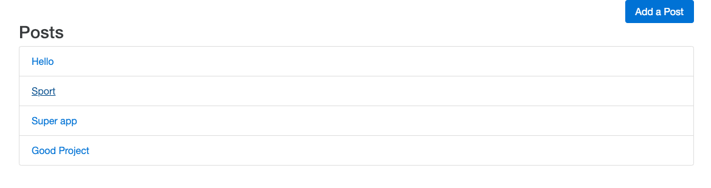

# Blog App [](https://circleci.com/gh/Szalbik/ReactBlog/tree/master)

> Application to create simple posts.

## Table of contents

- [General info](#general-info)
- [Screenshots](#screenshots)
- [Technologies](#technologies)
- [Setup](#setup)
- [Features](#features)
- [Status](#status)
- [Inspiration](#inspiration)
- [Contact](#contact)

## General info

The purpose of this project is to learn well react and redux. My motivation is to get a job as a Front-end developoer. As the time go I will add new features to this project and learn new libraries.

## Screenshots



## Technologies

- react - version 
- redux - version 
- react-router-dom - version 
- redux-form - version 

## Setup

```
git clone git@github.com:Szalbik/ReactBlog.git
cd ReactBlog
npm install / yarn install
npm start / yarn start
```

## Features

List of features ready and TODOs for future development

- Show multiple posts
- Show single post
- Add post
- Edit post
- Delete post

To-do list:

- Login and Register User
- Add comments for posts

## Status

Project is: _in progress_. After creating simple blog application with posts, I will come back to this project when i have time and add new features.

## Inspiration

Project inspired by [@Stephen Grider](https://github.com/StephenGrider), based on [@Udemy course](https://www.udemy.com/react-redux/)

## Contact

Created by [@Damian Szalbierz](https://github.com/Szalbik) - feel free to contact me!
